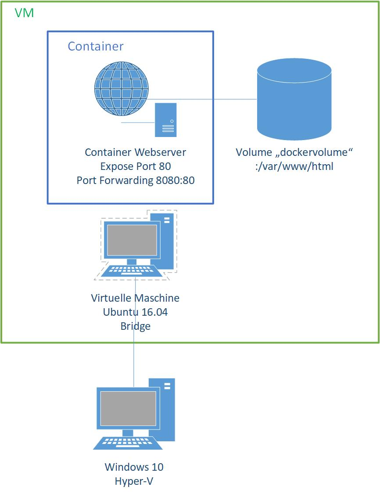
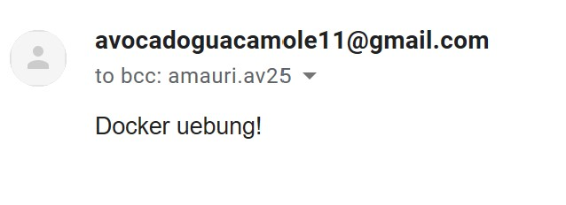

# Modul 300 LB2 - Amauri Valdez

# Inhaltsverzeichnis

- [Modul 300 LB2 - Amauri Valdez](#modul-300-lb2---amauri-valdez)
- [Inhaltsverzeichnis](#inhaltsverzeichnis)
- [Auftrag](#auftrag)
- [Service-Beschreibung](#service-beschreibung)
- [Technische-Angaben](#technische-angaben)
- [Testing](#testing)
- [Troubleshooting](#troubleshooting)

# Auftrag

In diesem Modul lernen wir verschiedene Dienste, Virtualisierungssoftware und Versionierungstool kennen. Mein Auftrag war es einen Container innerhalb einer Virtuellen Maschine (VM) anhand eines Dockerfile automatisch einen Container zu erzeugen. 

# Service-Beschreibung

Ich habe als Dienst einen Webserver eingerichtet, welcher ein mit php / html betriebenes Web-Formular anzeigt, und eine E-Mail via SSL (python) an den Google Mail Server sendet. Das E-Mail wird anhand eines Python Scripts, das ich geschrieben habe, gesendet. 

# Technische-Angaben

Ich habe eine Ubuntu VM innerhalb von Hyper-V erstellt und diese als Bridge gestellt, damit ich Docker herunterladen konnte. Nach der Installation habe ich auf der Ubuntu VM, Docker installiert. In der Ubuntu VM habe ich ein Dockerfile mit folgendem Code geschrieben.  

```
FROM php:5.4-apache

EXPOSE 80

RUN apt-get clean 
```

Nachdem ich das Image mit dem Commando erzeugte, war dieses nun einsatzbereit

```
docker build -t dockerimage .
```

Daraufhin habe ich das Volume erstellt, in welchem ich später meine php,python Files abspeichern werden.

```
docker volume create --name dockervolume
```

Das Volume wird erfolgreich erstellt und ist mit dem Kommando ***docker volume ls*** ersichtlich.

Der Container wird daraufhin mit dem untenstehenden Kommando gestartet (natürlich anhand des Images) und später via Port 8080 erreichbar sein.
```
docker run -d -p 8080:80 -v dockervolume:/var/www/html dockerimage
```

Da meine Dateien noch auf der Ubuntu Maschine liegen, muss ich mit dem Terminal in das Verzeichnis gehen wo meine Dateien sind. Meine drei Dateien ***sendmail.py, index.php, imagefeedback.png*** werden mit Hilfe des Befehles in das nun gemounted Volume kopiert:

```
docker cp sendmail.py "containerid":/var/www/html/sendmail.py
docker cp index.php "containerid":/var/www/html/index.php
docker cp imagefeedback.png "containerid":/var/www/html/imagefeedback.png
```

Nun sind alle drei Dateien im Volume gespeichert und bei jedem herunterfahren oder löschen des Containers, sind noch alle Dateien im Volume enthalten.

Wenn man will kann nun der Container gestopt werden mit ***docker stop containerid*** , und diesen löschen mit ***docker rm containerid***.

Ein neuer Container könnte jetzt wie oben gezeigt erstellt und das Volume gemounted werden. Die Daten sind nun permanent auf dem Volume abgespeichert und werden nur im Falle der Eliminierung des Volume gelöscht (***docker volume rm dockervolume***)).




# Testing


| Testfall        | Soll           | Ist  | Datum |
| ------------- |-------------| -----|----------|
| Webseite ist erreichbar via Port 80 mit Portforwarding 8080  | Die Webseite kann vom Lokalen PC aufgerufen werden| Die Webseite ist aufrufbar und der Port 8080 ist aktiv. "VM-ip":8080 in Webbrowser getippt. | 11.04.2019|
| E-Mail    | Das E-Mail kann erfolgreich gesendet werden     | Das E-Mail wird erfolgreich in der Inbox angezeigt.  | 11.04.2019 |
| E-Mail verschlüsselt | Die E-Mail wird via TLS versendet  |  Der E-Mail parameter TLS ist auf True und die E-Mail ist somit verschlüsselt. | 11.04.2019 |
| Image | Das Image wird erfolgreich anhand des Dockerfile erstellt | keine Fehlermeldungen wurden returniert| 11.04.2019
|Container | Container wird anhand des Images erstellt und ohne Fehlermeldungen | Der Container wird ohne Probleme erstellt und kann mittels eigenem Dockerimage erstellt werden |11.04.2019 |
| Volume | Das Volume enthält die nötige Applikation und kann an Container gemounted werden | Die Dateien wurden in das Volume kopiert und nach jedem mounten des Volume an eine VM, sind die Daten vorhanden. |11.04.2019
| 


# Troubleshooting

In der LB1 habe ich alles auf einer Ubuntu VM mit php und den Komponenten phpmailer, composer und weitere Libraries installiert. Das funktionierte Einwandfrei jedoch konnte ich in der docker Umgebung meines Containers diese nötigen Libraries nicht herunterladen (E: unable to locate Packages). Ich hatte zur dieser Zeit nur eine Ubuntu 14.06 Maschine. Mit dem Befehl ***apt-get install update*** / ***apt-get install upgrade***, dachte ich wäre die Sache gegessen, aber da hatte ich mich getäuscht. Ich versuchte wieder das Paket mit dem Befehl ***apt install composer*** , die composer komponente zu installieren, aber ohne Erfolg. Im Internet recherchierte ich unzählige Stunden, aber ich fand nie eine richtige Lösung. Das seltsame war, das in meiner Docker Ubuntu VM die Pakete vorhanden waren und somit installiert werden konnten, was ich daraufhin tat, um zu testen, ob es vielleicht am Image läge. Das Herunterladen auf meiner Ubuntu Docker VM funktionierte Einwandfrei. Ich fand für mein Container Problem keine Lösung im Internet. Ich probierte zahlreiche Ubuntu versionen 14.06/16.04/16.06 und diverse Php Versionen 5.4/7 etc., aber nichts half. Ich lass im Internet etwas von einem Docker Composer Container, den ich letztlich herunterlud, aber dieser löste mein Problem ebenfalls nicht. 

Mein Php Code wollte schlichthin einfach nicht funktionieren. Die Ressourcen die für das Sender der E-Mail nötig waren, waren nicht vorhanden und so stellte es mein Projekt etwas auf den Kopf. Ich überlegte lange und stoss im Internet folglich auf einen php5.4 Apache Image, das ich von der Docker Registry beziehen konnte und so einen php Container erstellen konnte. Alle meine Hoffnungen waren wieder zurück, aber wieder erhielt ich die gleiche Fehlermeldung, das die Pakete nicht aufgefunden werden konnten. Ich entschied mich spontan ein Python Skript zu schreiben, das das Mail versenden würde. Nun passte ich mein Webformular etwas an, damit es das Python Skript ausführen würde. Leider ist es mit Python nicht möglich meine php Variabeln aus dem Index.php zu lesen, weshalb ich die Senderadresse und den Inhalt im Python File Hardcoden musste. 

Ich wollte nicht kurzfristig meine Webseite komplett verändern, da mir das Layout etc. gefallen hat. Der Inhalt wird selbst vom Python Skript bestummen und die Authentifizierung findet wie gewohnt per TLS staht. Beim Aufrufen der Webseite aus meiner Windows 10 Maschine wird ein Mail versendet, sobald ich auf den Submit Button drücke, jedoch wird das Skript kurzfristig local gecached und ausgeführt. Das E-Mail habe ich zum Glück erhalten, weil ich auf meiner Windows Maschine Python installiert hatte.

Letztlich funktionierte alles und das E-Mail war in der Inbox meiner E-Mail-Adresse.





